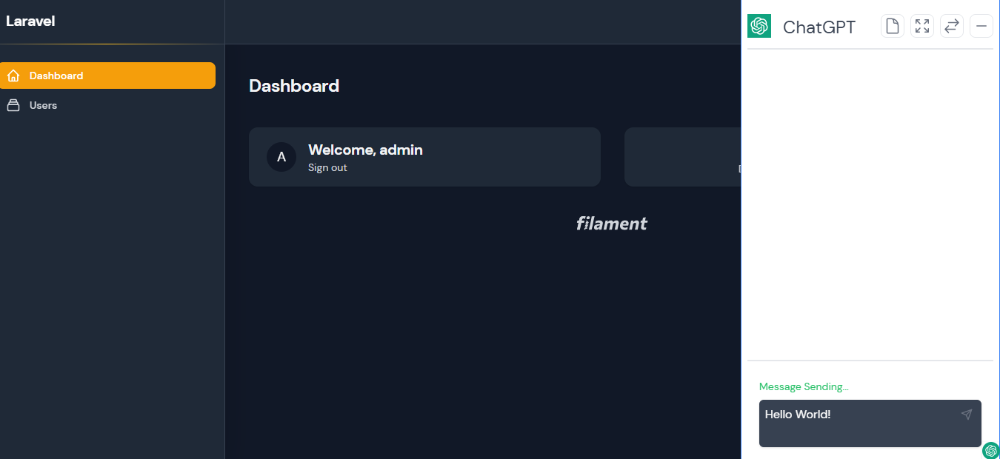
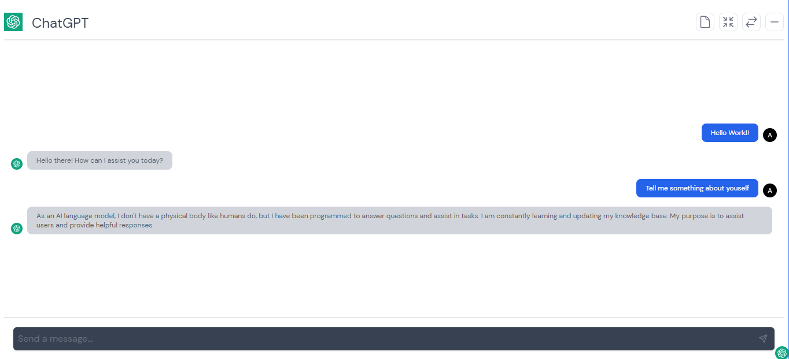
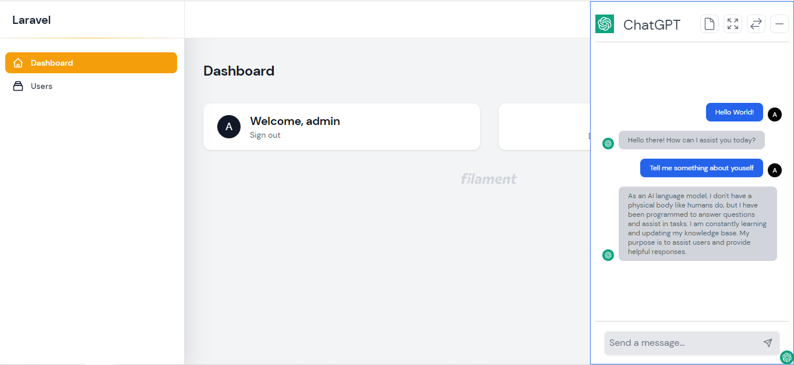

# ChatGPT Intergration 

Filament ChatGPT Bot is a filament plugin that allow you to use ChatGPT out of the box within Filament Application. 

Full Screen:

Light Mode:


## Feature

- Integrate with ChatGPT
- Easy to Setup
- Shortcut allows control of panel in more convenient way
- Support for dark mode


## Installation

First, you can install the package via composer:

```bash
composer require icetalker/filament-chatgpt-bot
```

## Publish Config Files

Next, you can publish the config files with:

```bash
php artisan vendor:publish --tag="filament-chatgpt-bot-config"
```

This will create a `config/filament-chatgpt-bot.php` configuration file in your project, which you can modify to your needs using environment variables:

```
OPENAI_API_KEY=sk-...
```

Go to admin panel, you will see a small icon in gray color on the bottom-right corner of every page. Click the icon, you could see a chat panel. And now you can talk to OpenAI ChatGPT with the chat panel. Click the small icon agin, the chat panel will be hided again.

By add the `OPENAI_PROXY` to `.env` file, you could use http proxy to connect ChatGPT. Example as below:

```
OPENAI_PROXY=127.0.0.1:8080
```

## Views

Optionally, you can publish the views using

```bash
php artisan vendor:publish --tag="filament-chatgpt-bot-views"
```

## More

You could hide the chatgpt icon by setting `enable` to `false` on `config/filament-chatgpt-bot.php`:

```php

    'enable' => false,

```

and you can add it to the blade page you like manually:

```blade
...

@livewire('filament-chatgpt-bot')
```

## Changelog

Please see [CHANGELOG](CHANGELOG.md) for more information on what has changed recently.

## Security Vulnerabilities

Please review [our security policy](../../security/policy) on how to report security vulnerabilities.

## Credits

- [Martin Hwang](https://github.com/icetalker)
- [All Contributors](../../contributors)

## Support

Any Problem please email: martin.hwang@outlook.com.
